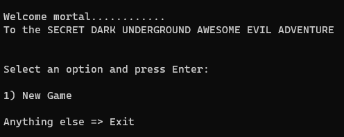
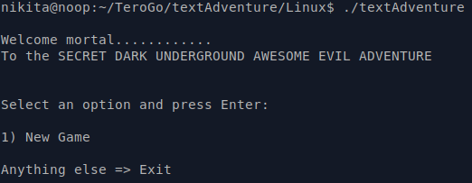
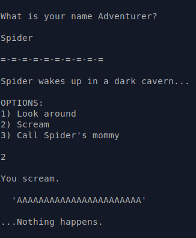

# textAdventure
My tiny textAdventure source-code and compiled binaries for the Go-course taught by Tero Karvinen http://terokarvinen.com/2020/go-programming-course-2020-w22/

This repository contains binaries for Linux, MacOS and Windows.

# Installation:
Clone this repository in the terminal of your choice:

`git clone https://github.com/Nikitushka/textAdventure.git`

Navigate into the cloned directory:

`cd <path-to-directory>`

# Running the binary:

Windows cmd/PowerShell: 

`.\textAdventure.exe`

Linux/MacOS terminal:

`./textAdventure`

# The Game:
The gameplay is relatively simple: you are given numerical options, and you choose which one you want.
However, if you wish to be a Mr./Mrs. Smartypants about it, prepare for unforeseen consequences.

